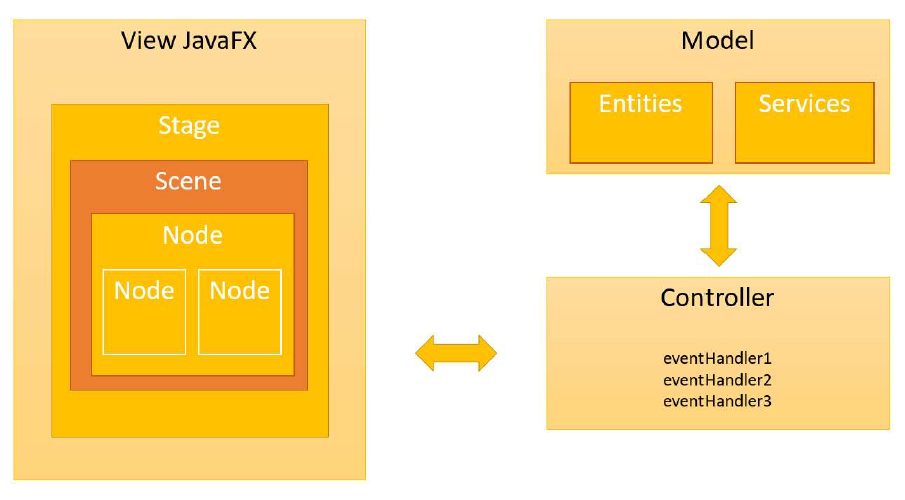

# interface-grafica-com-javafx

Neste repositório há recursos abrangentes sobre a criação de interfaces gráficas usando JavaFX, um framework para 
aplicações desktop e web. 

### Requisitos Necessários
- Programa SceneBuilder instalado
- Biblioteca JavaFX instalada

A visão geral do JavaFX e o padrão MVC (Model-View-Controller) no projeto se resume a criar aplicações bem estruturadas e de 
fácil manutenção. 

O ambiente de desenvolvimento no Eclipse foi preparado para utilizar o JavaFX, permitindo a criação e testes de 
arquivos FXML para layouts personalizados. Além disso, é utilizado o Scene Builder, uma ferramenta visual que 
agiliza o design de interfaces. 

A interatividade também é abordada nesse projeto, mostrando como lidar com eventos, como cliques de botões e exibição 
de caixas de diálogo de alerta. Em um exemplo prático, é feito o uso de TextField e Label para criar um simples calculador de soma.

É apresentado como utilizar a interface Initializable para inicializar os componentes da interface. Além disso, 
foi utilizado ComboBox para permitir que os usuários escolham opções a partir de uma lista suspensa.

Este repositório serve de fonte para aprimorar habilidades em interfaces gráficas e construir aplicações mais amigáveis 
e funcionais.

Esse projeto faz parte do curso de Java do professor Nélio Alves na Udemy.
